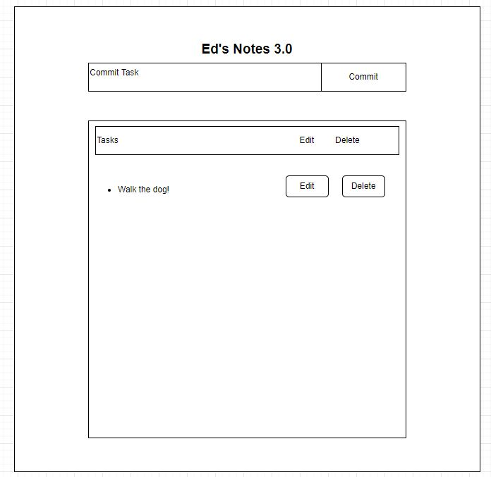

# Ed's Notes
https://edsnotes4.herokuapp.com/

Ed's Notes is a website designed to keep me, Edwin William, organized and accountable.

As someone who is always on the move, I needed somehwere to track my activities, appointments, commitments. Example:
* Family commitments
* Work commitments
* Personal commitments

How to:
* When the app is running, simply type in your task into the inbox, then click commit.
* After committing, your task will be populated into the space below.
* In the space below, you'll be able to check off, edit, and delete tasks.
* Tasks will be saved in database.
    Unfinished Functiontionality:
    * Although backend was built, I had trouble connecting to frontend of app. 
    * Connecting both the front and backend has been a trouble for me
        * This is defintely an area that I need and will practice more often.
        * Building and connecting databases are a component of my current employment, and future employemnt
    * The design of Ed's Notes was more for functionality than style, due to time, and technical constraints.

Technologies Used:
* React JS
* Node JS
* PostgreSQL
* Heroku
* Github

Wireframe:
Method  |   Path    |   Purpose
----------  |   ----------  |   ----------
Get     |   /           | login page
Post    |   /tasks      | create a new task
Get     |   /tasks/:id  | specific task
Put     |   /task/:id   | update task
Delete  |   /task/:id   | delete task   

 

Database:

Users:
Name    |   Data-type   |   Prop
------------- | ------------- |------------
users_id    |   Interger |   primary key
name    |   VARCHAR    |   NOT NULL
email   |   VARCHAR |   NOT NULL

Tasks:
Name    |   Data-type   |   Prop
------------- | ------------- |------------
tasks_id    |   Interger |   primary key
description   |   VARCHAR    |   NOT NULL  

References:
* Stackoverflow.com
* www.w3schools.com
* NJIT SD-03 Canvas courses
* www.youtube.com
* www.sequelize.org
